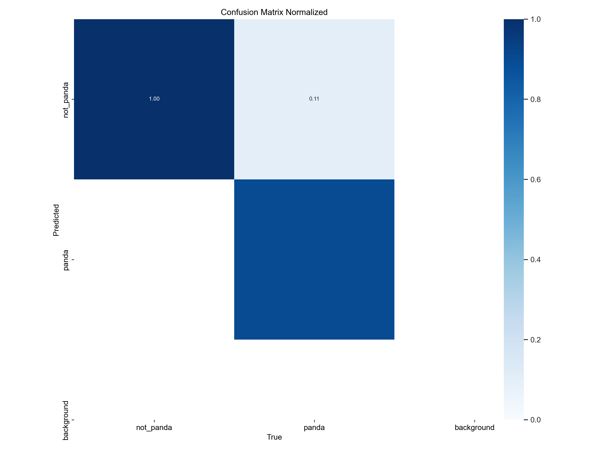

# Задание 3
## Описание задания
В задании требуется обучить нейронную сеть, которая будет распознавать
картинки с красными пандами среди других картинок.\
Требуется добиться не менее 65% верно-положительных и верно-отрицательных результатов.
## Описание решения
### Обоснование выбора модели
Для решения задачи была выбрана модель **YOLOv8n-cls**.\
Эта модель принадлежит к множеству CV моделей YOLOv8.

Модели YOLOv8 это state-of-the-art модели компьютерного зрения,
которые повсеместно используются в индустрии.

Данная модель предназначена для задачи классификации изображений
и имеет наименьшее кол-во параметров из всех других моделей
YOLOv8, предназначенных для классификации.

Именно эта модель была выбрана для fine-tuning, так как она имеет
достаточную мощность для решения данной учебной задачи и при этом
не требует много времени на fine-tuning.

Для fine-tuning была выбрана её pretrained версия, обученная на
ImageNet датасете.
### Описание набора данных для fine-tuning
Для fine-tuning нужен набор данных, содержащий достаточное количество
изображений различных животных и в частности красных панд.

При обучении классификационной YOLOv8 модели на кастомном наборе данных,
набор данных должен иметь определённый вид.

Правильный вид набора данных для обучения приведён по 
[ссылке](https://docs.ultralytics.com/datasets/classify/).

Я составил набор данных, состоящий из трёх папок train, val и test.
Изображения в этих папках различны.


В каждой из этих папок было ещё две папки. Они назывались panda и not_panda.
Это и есть названия классов для классификации, так как модель делит все
изображения на два класса - содержащие красную панду, или не содержащие.

В папках с названием *not_panda* содержались изображения животных из набора данных ниже
, которые не являются пандами.

В папках с названием *panda* содержались изображения красных панд из наборов данных ниже.

В папке train 5446 изображений.\
В папке val 1790 изображений.\
В папке test 1523 изображения.

Для составления набора данных использовались изображения из источников ниже:
1. [Изображения различных животных](https://www.kaggle.com/datasets/alessiocorrado99/animals10/data)
2. [Изображения красных панд](https://universe.roboflow.com/mauriziot/redpanda/dataset/1)
3. [Изображения красных панд](https://universe.roboflow.com/object-detectionred-pandali-qiuyang/red-panda-zzk0j/dataset/1)
4. [Изображения красных панд](https://universe.roboflow.com/yo-tqhqy/cosmetic-t84yi)

### Ход решения
Для fine-tuning модели на собранном наборе данных был создан скрипт **train.py**.

Он принимает в качестве аргументов путь к набору данных для fine-tuning,
количество эпох обучения и размер изображения в пикселях, к которому
приведутся все изображения в наборе данных.

Пример запуска скрипта:

```
python train.py -d "path/to/dataset" -e 10 -img_size 224
```

Я обучал модель при параметрах epochs=10 и imgsz=224.

Веса модели после fine-tuning доступны по [ссылке](https://drive.google.com/file/d/1rs8TCPFwoKP_fbFV8k5tzvI2tHHLynB4/view?usp=sharing).

С помощью скрипта **predict.py** можно загрузить модель YOLO с этими весами
и с её помощью определить, есть ли на изображении красная панда или нет.

Этот скрипт в качестве параметров принимает путь до файла с весами модели и
путь до изображения для классификации.

Пример запуска скрипта:

```
python predict.py -m "trained_model_weights.pt" -i "path/to/img"
```

### Результат

Ниже приведена нормализованная confusion matrix, которая была
создана после валидации модели. По ней видно, что полученная
после fine-tuning модель удовлетворяет требованиям в задании
по точности классификации картинок.

